# Python 入门教程  

[toc]

## 简介  

Python是一种跨平台的编程语言。它是一种解释型、面向对象、动态数据类型的高级编程语言，它是由Guido van Rossum于1989年开发出来，遵循GPL协议。在2020年1月1日，Python官方宣布停止Python 2的更新，所以本教程使用[Python 3.7.7](https://www.python.org/downloads/windows/python)。  

Python有什么特点呢？  

- **易于学习**：Python的关键字相对较少，结构简单
- **易于阅读**：Python的代码定义清晰，可读性性高
- **广泛的标准库**：Python拥有丰富的库，跨平台，可以说，你能想到的功能，Python都有现成的库可供使用

那么Python可以做什么呢？  

- 日常任务，比如定期备份资料；
- 做网站，国内的豆瓣，Google的Youtube，都是用Python写的；
- 也可以做网络游戏的后台；
- 等等  

那么本教程适合哪些人群学习呢？  

- 会使用电脑，但是从没写过程序；
- 想通过编程简化部分日常工作
- 每天可以抽出半小时左右时间学习

> 注：目前Python的最新版为3.8.2  

## 环境搭建  

本章节我们介绍如何搭建Python的开发环境。  

考虑到本教程是面向编程基础为0的用户，所以这里就以Windows系统为例来搭建开发环境。  

### Python下载  

有关Python的最新源码、二进制文件、文档等资讯都可以从[Python官网](https://www.python.org/)获取。  

本教程使用的Python3.7.7，可以从[这里](https://www.python.org/downloads/release/python-377/)获取。  

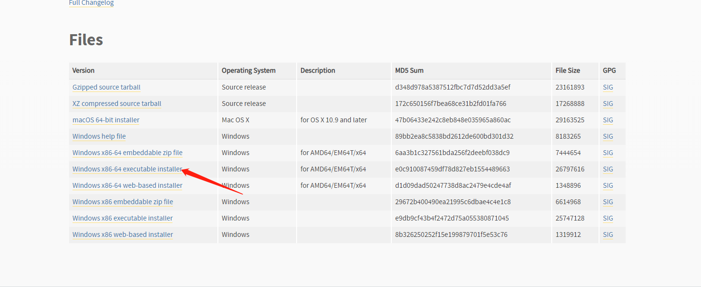

### Python安装   

Windows版的Python，遵循Windows系统一贯的傻瓜式的“Next”安装方式，安装步骤如下：  

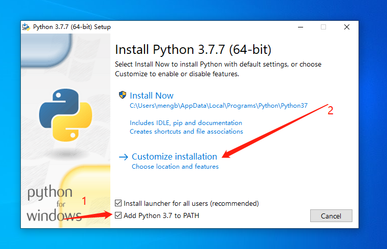  

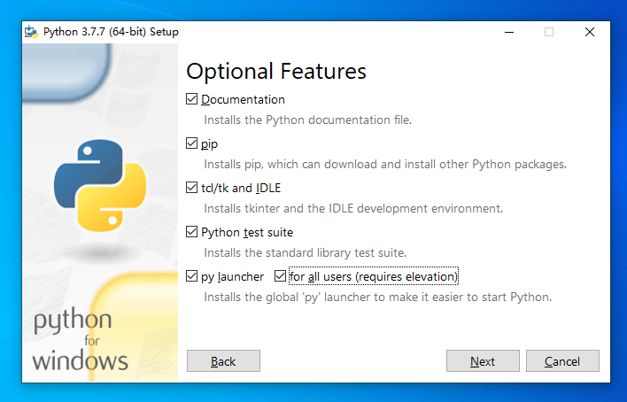  

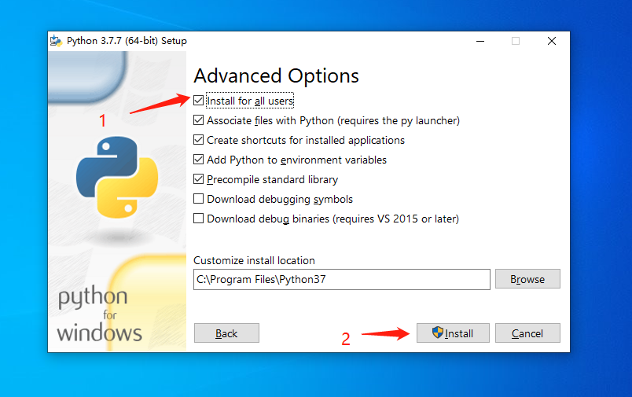  

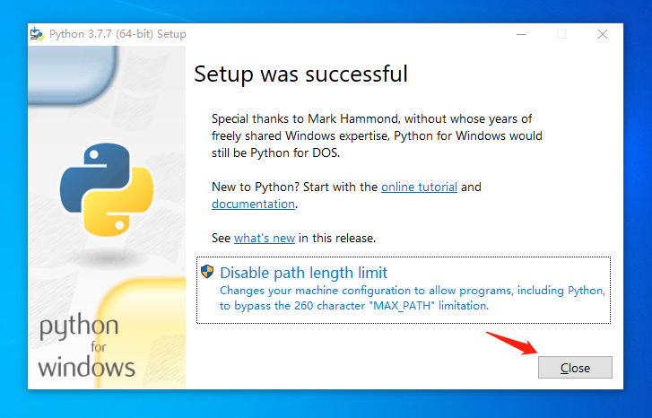  

### 第一个Python程序  

在Windows的左下角的搜索框中输入`powershell`，如下图：  

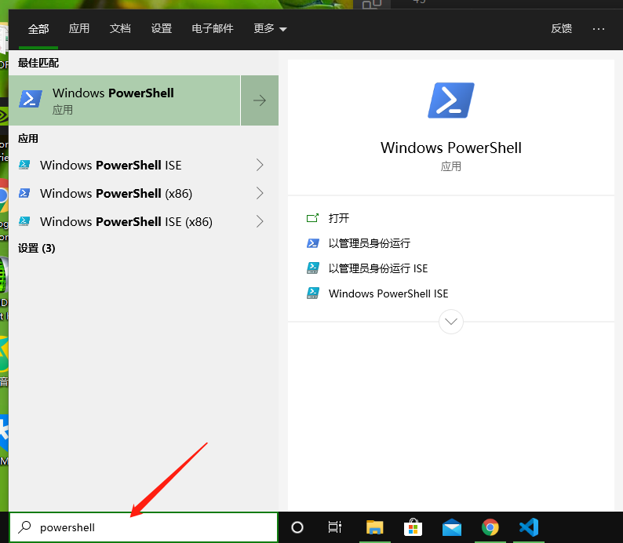  

回车之后会打开一个黑窗口，在其中输入`python`，结果如下图：  

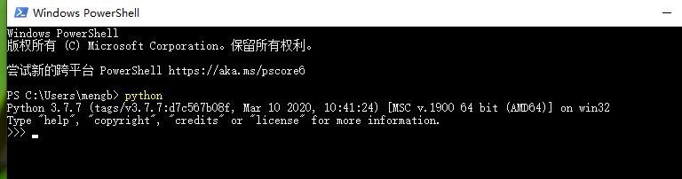  

之后输入如下内容：  

```python
print('hello world')
```  

得到下面的图：  

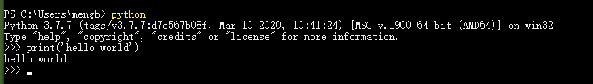  

### 选择合适的编辑器  

对于编程而言，一个适合自己的编辑器能起到事半功倍的效果。这里推荐微软推出的跨平台的文本编辑器**VSCode**。  

vscode可以从[这里](https://code.visualstudio.com/Download)下载，选择如下：  

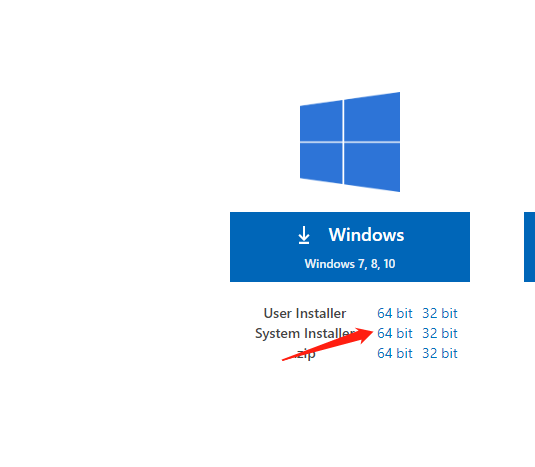  

下载完成后双击安装即可。  

### 配置vscode  

安装完成后，打开vscode，操作如下：  

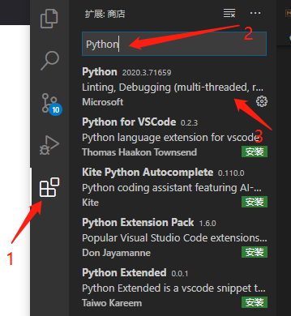  

汉化vscode：  

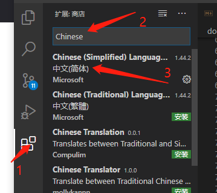  